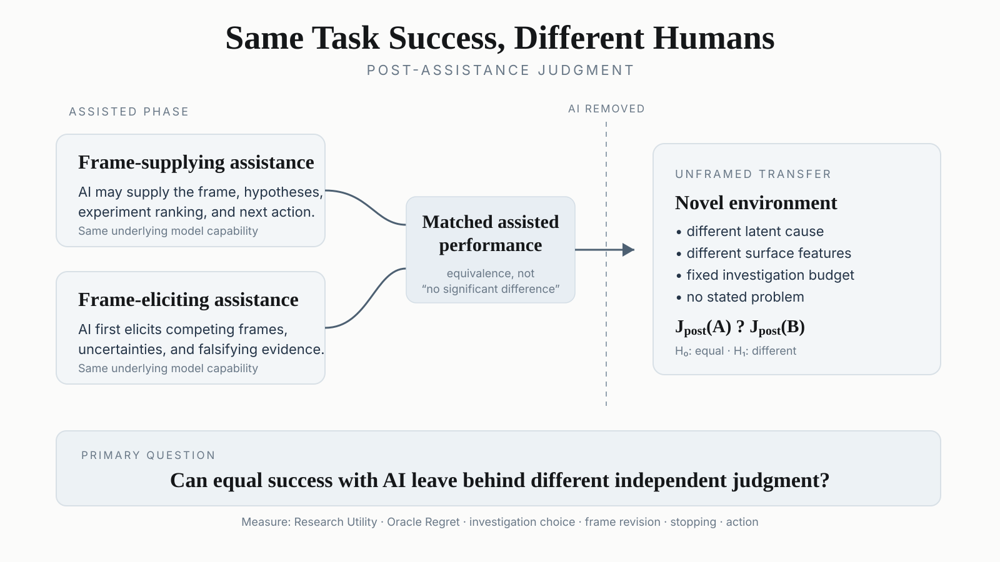
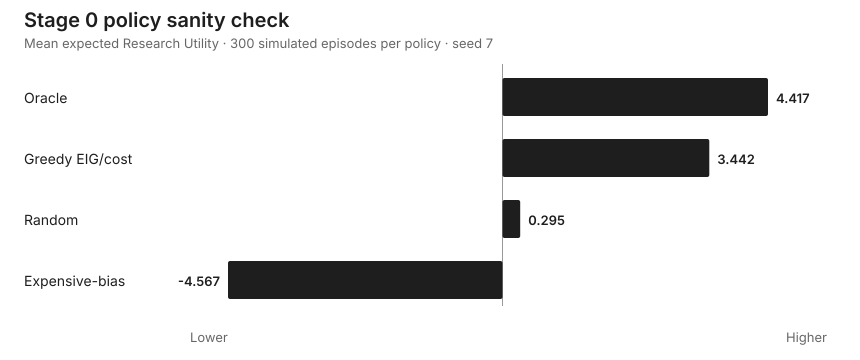

# PAJ-Eval

### Same task success. Different humans afterward?

**PAJ-Eval** is an experimental benchmark for **post-assistance judgment**: whether AI interaction policies that look equally successful during assistance can leave people differently able to frame, investigate, revise, and act on a novel problem after the assistant is removed.

> **Core question:** After AI assistance is removed, can a person still determine what is worth investigating when the next problem has not been specified for them?

<p align="center">
  
</p>

**Current status:** v0.2 design · Stage 0 executable instrument · first Stage 1A counterfactual pair implemented · blinded expert environment validation next.  
**Research note:** [Same Task Success, Different Humans](https://thirdstructure.wordpress.com/2026/09/15/same-task-success-different-humans/)  
**Canonical repository:** `hippoley/PAJ-Eval`

---

## The evaluation object

Most AI evaluations stop when the assisted task ends. They measure the model, or the human–AI pair, while assistance is present.

PAJ-Eval asks what the human can independently do **afterward, when nobody has framed the next problem for them**.

A valid post-assistance task has three mandatory properties:

1. **Assistance is absent.**
2. **The next problem is unframed.**
3. **Information acquisition is endogenous:** the participant chooses what evidence to inspect under a finite budget.

The observable object is therefore a trajectory rather than a single answer:

```text
observation → framing → hypothesis → investigation → revision → stopping → action
```

### Where this differs from adjacent work

| Adjacent direction | What it mainly asks | PAJ-Eval adds |
|---|---|---|
| [OpenAI GeneBench-Pro](https://openai.com/index/introducing-genebench-pro/) | Can an AI exercise research judgment under ambiguity? | What happens to the **human's** independent judgment after AI assistance? |
| [Anthropic TASTE](https://alignment.anthropic.com/2026/taste/) | Can models agree with experts about research quality? | Sequential judgment observed behaviorally in an **unframed** environment. |
| [Anthropic skill-formation RCT](https://www.anthropic.com/research/AI-assistance-coding-skills) | Does AI assistance change later mastery of a known skill? | Can a person independently determine **what problem is present and what evidence to seek**? |
| [Anthropic disempowerment](https://www.anthropic.com/research/disempowerment-patterns) | Are real-world AI interactions associated with distorted beliefs, values, or actions? | A controlled post-assistance task with known latent ground truth and objective information-seeking opportunities. |

> **Known-skill transfer starts after the task has been specified. PAJ-Eval starts one step earlier, where the person must construct the task worth pursuing.**

## Measurement approach

PAJ-Eval starts with synthetic research worlds generated from a known latent causal model.

Each investigation has a cost, an observation distribution conditional on the hidden cause, and calculable expected information value. The benchmark can therefore distinguish a cheap discriminating diagnostic from an expensive action that creates activity but little epistemic progress.

The confirmatory decision score is **Expected Research Utility (ERU)**: evidence-justified terminal decision value minus investigation cost. Realized outcome is tracked separately so the benchmark does not confuse good judgment with stochastic luck.

See [`SPEC.md`](SPEC.md).

## Cleaner causal intervention: same information, different order

A broad “direct assistant vs. Socratic assistant” comparison changes too many variables at once.

v0.2 therefore proposes an **information-yoked sequencing intervention**. For each assisted training world, freeze one canonical assistance packet containing the same hypotheses, evidence interpretation, diagnostic options, and recommended next steps.

- **Frame-first:** the AI frame appears before the participant forms their own problem representation.
- **Self-frame-first:** the participant first records a **private, non-binding, explicitly revisable** snapshot of their frame, competing explanations, important uncertainty, and next investigation; the exact same assistance packet is then shown.

```text
same task
same eventual AI information
same assistance packet
        ↓
AI frame before self-frame
              vs.
self-frame before AI frame
        ↓
assistant removed
        ↓
novel unframed environment
        ↓
post-assistance ERU
```

Assisted-task performance is an **arm-level design gate**, not a participant-level matching variable. If the two-arm pilot shows an effect, a follow-up should add an **effort-yoked control** to separate self-framing from generic extra cognitive effort.

See [`STUDY_PROTOCOL_v0.2.md`](STUDY_PROTOCOL_v0.2.md).

## Stage 0: executable sanity check

The original toy world contains four hidden causes, seven investigations, a finite budget, stochastic observations, posterior updates, ERU / realized utility, and an exact finite-budget oracle planner.

Across 300 deterministic simulated episodes per policy:

| Policy | Mean expected Research Utility | Mean cost | Mean EIG | Mean steps |
|---|---:|---:|---:|---:|
| Oracle | **4.417** | 3.593 | 0.759 | 1.710 |
| Greedy EIG/cost | 3.442 | 5.310 | **0.925** | 2.537 |
| Random | 0.295 | 5.027 | 0.448 | 2.063 |
| Expensive-bias | -4.567 | 8.000 | 0.195 | 2.000 |



The useful signal is not merely that the oracle wins. **Greedy information gathering accumulates more raw EIG than the oracle while achieving lower Research Utility.** The environment can therefore represent the difference between gathering information and knowing when information is worth its cost, when to stop, and when to act.

Stage 0 does **not** establish that AI changes human judgment or that the toy environment already measures real research judgment.

## Stage 1A: first counterfactual flip

The first adversarial pair is now executable.

Both worlds present the same high-level anomaly: performance falls after a training-stack update and repeated runs disagree. The action menu, costs, observation model, rewards, and budget are held fixed. Weak contextual evidence changes which causal family is most plausible.

| World | Oracle first action | Oracle expected utility | Forced opposite-world action | Regret |
|---|---|---:|---|---:|
| A | `rerun_seeds` | 6.158 | `recompute_metrics` | 1.190 |
| B | `recompute_metrics` | 5.970 | `rerun_seeds` | 1.150 |

This is a **mechanical counterfactual-sensitivity pass**, not yet human-validity evidence. It proves only that the formal environment can encode a meaningful first-action flip.

The harder question is now external:

> Do experienced researchers, blind to the likelihood tables and oracle, recognize the same distinction as scientifically defensible?

Files:

- [`STAGE1A_COUNTERFACTUAL_PAIR.md`](STAGE1A_COUNTERFACTUAL_PAIR.md) — mechanical result and failure conditions
- [`paj_eval/stage1a.py`](paj_eval/stage1a.py) — pair implementation
- [`tests/test_stage1a_pair.py`](tests/test_stage1a_pair.py) — counterfactual tests
- [`EXPERT_WALKTHROUGH_STAGE1A.md`](EXPERT_WALKTHROUGH_STAGE1A.md) — blinded expert protocol
- [`expert_walkthrough_stage1a.html`](expert_walkthrough_stage1a.html) — standalone response form
- [`analyze_stage1a_experts.py`](analyze_stage1a_experts.py) — pre-specified response analysis

## The instrument should be easy to kill

PAJ-Eval should not advance merely because the current implementation runs.

Before treatment testing, it must survive:

- **counterfactual sensitivity** — similar surface evidence can require a different investigation;
- **surface invariance** — cosmetic rerendering should not change the normative world state;
- **heuristic resistance** — simple fixed strategies remain meaningfully below oracle;
- **expert coherence** — benchmark-preferred evidence is recognizable as useful research evidence;
- **leakage audit** — superficial wording cannot reveal the intended answer;
- **omitted-action audit** — experts may propose investigations missing from the menu;
- **reward robustness** — modest changes to priors, costs, or penalties do not reverse the benchmark;
- **discriminant validity** — score must not collapse into ML trivia or generic Bayesian numeracy.

See [`MEASUREMENT_VALIDITY.md`](MEASUREMENT_VALIDITY.md) and [Issue #1](https://github.com/hippoley/PAJ-Eval/issues/1).

## Alignment implication under test

PAJ-Eval is motivated by a distinction between two forms of control:

- **Nominal control:** the human retains the formal right to approve, reject, interrupt, or redirect the system.
- **Epistemic control:** the human can independently notice missing evidence, construct a competing problem representation, recognize when the system is solving the wrong problem, and know when rejection is warranted.

> A human can retain the right to reject an AI while losing some of the independent judgment required to know when rejection is warranted.

This is a hypothesis to test, **not a result already established**.

## Run the prototype

```bash
python -m pip install -e .
python demo.py
pytest -q
```

The exact test count may grow as validity checks are added; public GitHub Actions is the source of truth for the current `main` branch.

## Repository map

```text
PAJ-Eval/
├── README.md
├── SPEC.md
├── STUDY_PROTOCOL_v0.2.md
├── MEASUREMENT_VALIDITY.md
├── STAGE1A_COUNTERFACTUAL_PAIR.md
├── EXPERT_WALKTHROUGH_STAGE1A.md
├── expert_walkthrough_stage1a.html
├── analyze_stage1a_experts.py
├── VALIDATION.md
├── REPRODUCIBILITY.md
├── STAGE_GATES.md
├── STAGE1_BUILD_BRIEF.md
├── paj_eval/
├── tests/
├── outputs/
└── assets/
```

## What would be most useful to challenge?

The highest-value feedback is a concrete way to make the construct fail.

1. Does the pair encode research judgment, or only the benchmark author's preferred Bayesian game?
2. Would you actually choose `rerun_seeds` in A and `recompute_metrics` in B?
3. What missing investigation would dominate the offered menu?
4. Can information-yoked sequencing still be explained by generic effort, consistency pressure, or demand effects?
5. What would have to change before a synthetic PAJ score should generalize to real research workflows?

Open the strongest objection you can make in [Issue #1](https://github.com/hippoley/PAJ-Eval/issues/1), or inspect the active [Stage 1A build issue](https://github.com/hippoley/PAJ-Eval/issues/2).

— **Jialun Lin**, Independent Researcher
